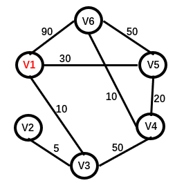
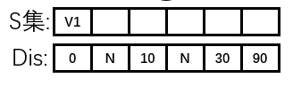
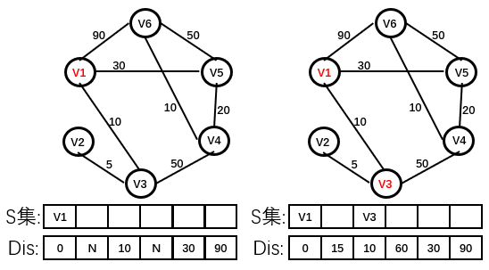
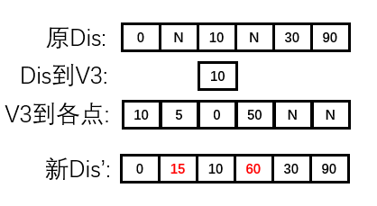
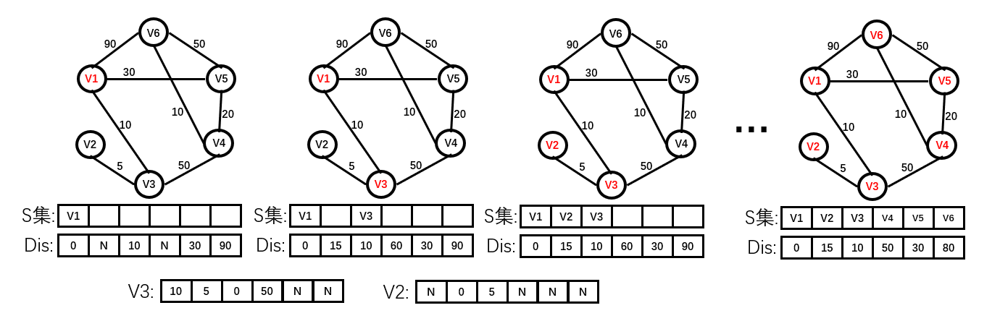
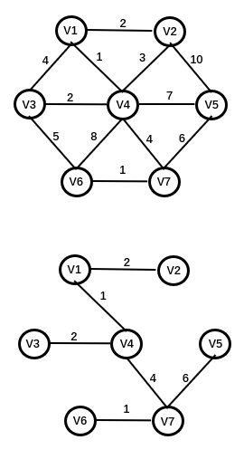
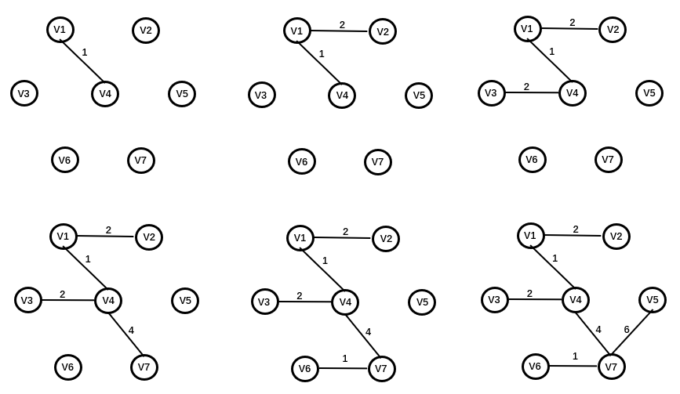
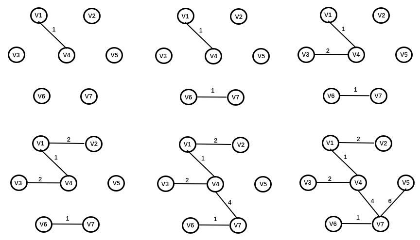

## 图论
### 主要定义
***图***：一个图 G = (V, E)由顶点集V和边集E组成。  
***环***：图含有一条从一个顶点到自身的一条边(v, v),那么路径v,v也称做一个环。  
***圈***：图中有一个顶点，包含能够到达自身的路径，并且该路径的边数大于1。  
***连通图***：无向图中所有的顶点到其他顶点都存在一条路径，称为连通图。  
***强连通图***：有向图具有连通图的性质，称为强连通图。  
***弱连通图***：有向图去掉方向约束之后具有连通图的性质，称为弱连通图。  
***完全图***：每一个顶点之间都存在一条边。  
  
## 图的表示
***邻接矩阵***：使用一个二维数组表示，其优点是表示方法简单，但空间消耗为O(v2)。故在*稀疏图*中空间浪费比较多。  
***邻接表***：每一个顶点使用一个表来存访其邻接的顶点，其优点是节省空间，空间消耗为O(v + u)。  
  

[邻接表图算法代码实现](./graph)  

## 拓扑排序
拓扑排序是针对有向无圈图的一种排序，如果存在vi->vj的路径，那么在排序中，vi必须排在vj之前。  
算法过程：  
每一次都寻找入度为0的顶点，从图中剔除该顶点并维护整个图的边集信息。  
重复以上，直到完成所有的顶点。  
```
void Topsort(Graph &G)	//拓扑排序的伪码表示
{
	int count = 0;
	Vertex v,w; 	//顶点
	
	for (count = 0; count < G.NumVertex; ++count)
	{
		v = FindVertexOfIndegreeZero(G);	//找到入度为0的顶点
		if (v == 0)
		{
			Error("Graph has a cycle!");
			break;
		}
		TopRes[count] = v;	//拓扑排序的结果
		for each w adjacent to v	//每一个该顶点的入度自减
		{
			Indegree[w]--;
		}	
	}
}
```

## 最短路径算法

### Dijkstra算法
迪杰斯特拉算法核心思想是贪心思想，将一个问题分解到多个阶段，每个阶段都求当前阶段的最优解。  
迪杰斯特拉算法时间复杂度为On2，其优点是，在解决两点间最短距离过程中，还解决了图的单源点最短路径问题。但是迪杰斯特拉算法不能解决负权值问题。  

首先，迪杰斯特拉算法定义了几个集合，S集和U集以及返回值Dis集。  
S集表示已知点之间的最短距离，U集表示剩下的还不确定最短距离的点，Dis集表示最终到各点的距离，即最终的解，但是在求解过程中，该集合可以认为是，通过S集中的点中转所能到达全局其他点的临时最优解。  
如下表示的一个图  
  
其初始S集只有V1一点，初始Dis集即为V1到各点的距离。  
  
更新过程如下图，dis表示当前到各点的临时最优解，当V3加入S集之后，V1到其他各点临时最优解可能没有经过V3中转的解更短。如V2，10 + 5 < N。(dis到V3 + V3到V2 < dis到V2)  
V3加入S集示意图如下。  
  
V3加入S集Dis集合更新结果如下。    
  
整个迪杰斯特拉S集和Dis集更新过程如下。  
  


### 邻接表表示的图Dijkstra算法代码实现  
```
std::vector<int> Dijkstra(const vector<vector<int> > &mygraph, int start)
{
	int pointsMax = mygraph.size();
	vector<int> vecs(pointsMax, 0);
	vector<int> ret(mygraph[start]);
	vecs[start] = 1;
	int pointcount = 1;
	while (pointcount < pointsMax)
	{
		int tempmin = MD;
		int curpos = 0;
		for (int i = 0; i < pointsMax; ++i)//剩下的集中找最小
		{
			if (vecs[i] == 0 && 0 < ret[i] && ret[i] < tempmin)//tempmin 指start到curpos的最小值
			{
				tempmin = ret[i];
				curpos = i;
			}
		}

		vecs[curpos] = 1;//加入S集

		for (int i = 0; i < pointsMax; ++i)//从curpos中转，比较近
		{
			if (vecs[i] == 0 && tempmin + mygraph[curpos][i] < ret[i])//更新最小值
			{
				ret[i] = tempmin + mygraph[curpos][i];
			}
		}

		pointcount++;
	}
	return ret;
}
```

## 最小生成树
无向图的最小生成树，指连通图中的最小连通子集，即图的最小生成树有n个顶点，n-1条边，并且边的权值和最小。  
  

### Prim算法
Prim算法与Dijkstra算法类似，也定义了一个S集，一个U集，S集中的顶点加入了最小生成树中，U集表示没有加入的顶点。整个算法也是从一点出发，每次都找S集与U集之间最短的路径，并把该路径终属于U集中的端点加入S集，直到所有顶点遍历完。  
Prim算法整个过程如图所示。  
  

### Kruskal算法
Prim算法的思想是从顶点的角度出发，对所有顶点遍历，生成最小生成树，而Kruskal算法则是从边集的角度考虑，每次加入权值最小的边，并且保证加入的新边不会成环，直到加入n-1条边。  
Kruskal算法整个过程如图所示。  
  