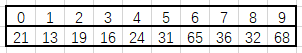
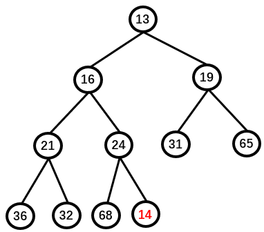
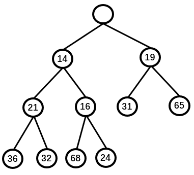

## 堆
  
优先队列(堆)是至少支持以下两种操作的数据结构：Insert(插入)，DeleteMin(删除最小)。  
  
一般使用一个一维数组结合相关堆算法来实现，假设根节点从0开始，那么父节点在i位置，左子节点在2*i+1位置，右子节点在2*i+2位置。  

### 建堆
根据原始数据，使用adjustHeap函数(也就是下溯操作)，从n/2(数组的一半)到根节点，调整数组形成堆。  
***原始数据：***  
  
***建堆：***  
  

### push操作
直接把新数据追加到数组尾部，然后使用上溯操作，将插入的数据上溯到正确位置。  
***插入数据：***  
  
***上溯过程：***  
  

### pop操作
把顶部数据删除，然后把最后面的数据(最大的数据)放到顶部，使用下溯操作调整。
***pop数据：***  
  
***下溯过程：***  
  

## 小顶堆的代码实现  
  
[小顶堆的代码实现](./堆)  