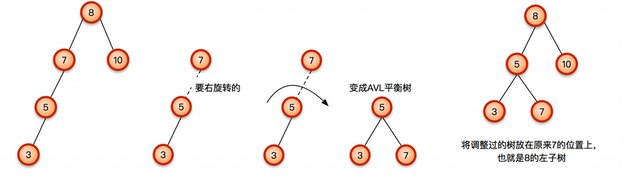
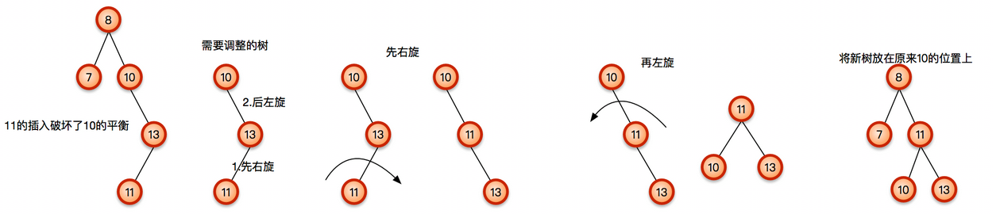

## 二叉树的遍历
前序递归遍历：  
```cpp
void preOrder(BTNode *root) 
{
	if(root == NULL) 
	{
		return;
	}
	cout << root->value << " ";	//visit操作
	preOrder(root->left);
	preOrder(root->right);
}
```
前序非递归遍历：  
```cpp
void PreOrderWithoutRecursion(BTNode* root)
{
	if (root == NULL)
	{
		return;
	} 
	BTNode* p = root;
	stack<BTNode*> s;
	while (!s.empty() || p)
	{
		if (p)
		{
			cout << p->value << " ";	//visit操作
			s.push(p);//访问后入栈，备用
			p = p->left;
		}
		else
		{
			p = s.top();
			s.pop();
			p = p->right;
		}
	}
}
```
中序递归遍历：   
```cpp
void inOrder(BTNode *root) 
{
	if(root == NULL) 
	{
		return;
	}
	inOrder(root->left);
	cout << root->value << " ";	//visit操作
	inOrder(root->right);
}
```
中序非递归遍历：  
```cpp
void InOrderWithoutRecursion(BTNode* root)
{
	if (root == NULL)
	{
		return;
	}
	BTNode* p = root;
	stack<BTNode*> s;
	while (!s.empty() || p)
	{
		if (p)
		{
			s.push(p);
			p = p->left;
		}
		else
		{
			p = s.top();
			s.pop();
			cout << p->value << " ";	//visit操作
			p = p->right;
		}
	}
}
```
后序递归遍历：  
```cpp
void inOrder(BTNode *root) 
{
	if(root == NULL) 
	{
		return;
	}
	inOrder(root->left);
	inOrder(root->right);
	cout << root->value << " ";	//visit操作
}
```
后序非递归遍历：  
```cpp
void PostOrderWithoutRecursion(BTNode* root)
{
	if (root == NULL)
	{
		return;
	}
	stack<BTNode*> s;
	BTNode* pCur, *pLastVisit;	//pCur:当前访问节点，pLastVisit:上次访问节点
	
	pCur = root;
	pLastVisit = NULL;
	while (pCur)	//先把pCur移动到左子树最下边
	{
		s.push(pCur);
		pCur = pCur->left;
	}
	while (!s.empty())
	{
		pCur = s.top();	//走到这里，pCur都是空，并已经遍历到左子树底端
		s.pop();
		//一个根节点被访问的前提是：无右子树或右子树已被访问过
		if (pCur->right == NULL || pCur->right == pLastVisit)
		{
			cout << p->value << " ";	//visit操作
			pLastVisit = pCur;
		}
		else
		{
			s.push(pCur); 	//根节点再次入栈
			pCur = pCur->right;	//进入右子树，且可肯定右子树一定不为空
			while (pCur)	//重复进入到左子树底端
			{
				s.push(pCur);
				pCur = pCur->left;
			}
		}
	}
}
```
## 平衡二叉树
平衡二叉树的定义：所有节点的左子树与右子树的高度之差的绝对值不超过1。  
  
插入方式分析

 插入方式  | 详细描述  | 旋转方式
 ---- | ----- | ------  
 LL  | 在节点的左子树的左边插入导致失衡 | 单右旋 
 RR  | 在节点的右子树的右边插入导致失衡 | 单左旋 
 LR  | 在节点的左子树的右边插入导致失衡 | 先左旋后右旋 
 RL  | 在节点的右子树的左边插入导致失衡 | 先右旋后左旋 
  
LL型  
  
RR型  
  
LR型  
  
RL型  
  
  
## 平衡二叉树代码实现  
  
[AVLTree的代码实现](./平衡二叉树)  

