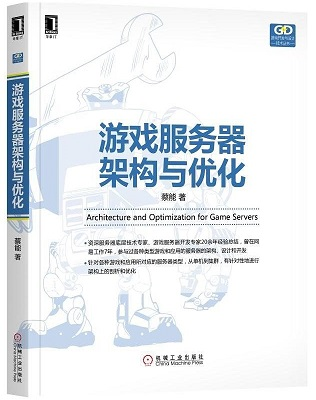
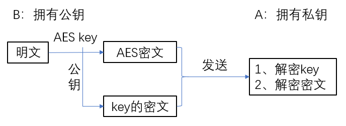
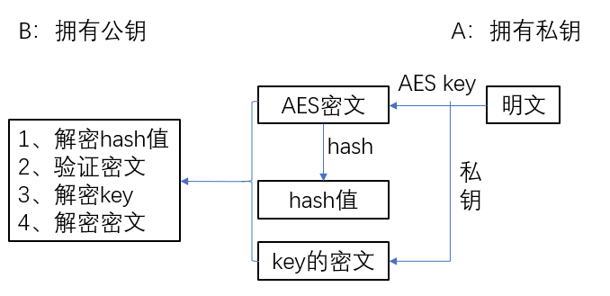
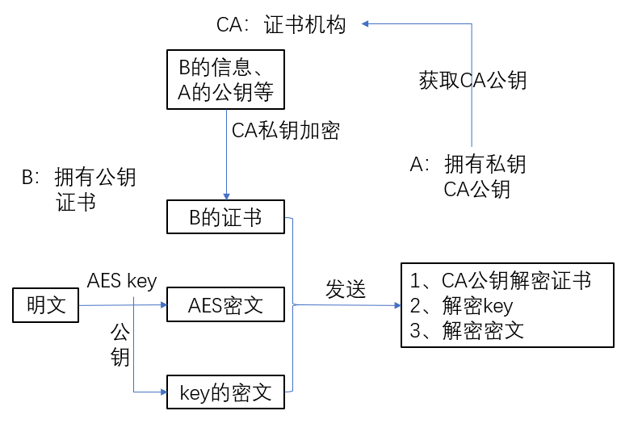

# 游戏服务器架构与优化  
这本书作者是蔡能，由机械工业出版社出版，讲的内容是有关游戏服务器的基本知识，整体比较简单适合初学者了解游戏服务器概况。  
由于我本人对于python网络模块的代码了解较少，所以跳过了书中有关python网络编程部分。  
  
  
## 目录
* [通信加密](#通信加密)
* [存储与数据库](#存储与数据库)
* [游戏服务器架构演变](#游戏服务器架构演变)
* [游戏服务器的交互](#游戏服务器的交互)

## 通信加密  
### 对称加密算法  
对称加密算法就是将明文与密钥经过加密算法的运算得到密文，再使用同样的密钥解密，得到明文。  
DES算法，使用64位的密钥加密。（其中56位是加密位，每8位的最后一位是校验位）  
AES算法，最常见的对称加密算法之一，微信小程序传输用的就是该算法。密钥的长度可以使用128位，192位或256位。  

### 非对称加密算法
对称加密算法一般相对比较简单，但是其缺点也很明显，就是密钥共享，这样N个人互相通信，需要N(N-1)对密钥，密钥的管理很麻烦。  
非对称加密有两个密钥，公钥（公开所有通信的人都可知道）和私钥，其中一个用于加密另一个用于解密。  
  
公钥加密，私钥解密：可以保证密文的安全性，因为别人没有私钥，不能解密。  
私钥加密，公钥解密：可以保证信息来源的安全，因为只有有私钥的人才能发出该信息，但是不能保证信息安全。  
  

A与B通信，其中A有本次通信的私钥，B有公钥。  
***场景一：B向A传文件***  
一般非对称加密不适合大文件的加密，所以，B使用对称加密算法AES加密明文得到密文，再使用公钥加密AES算法的密码，然后把这俩个密文传给A，A使用私钥解密得到AES密码，再用该密码解码密文得到明文，如果不能解开说明公钥错误或者信息被篡改过。  
B向A传文件整个过程如图：  
  
  
***场景二：A向B传文件***  
A将明文使用对称算法AES加密，再把加密后的密文使用hash算法散列得到一个散列值，再把该散列值用私钥加密，（当然该散列过程可以省略）再把AES算法的key使用私钥加密，把上述密文发送给B，B使用公钥解密获得散列值，校验密文的正确性，再解码AESkey，解码密文，最终得到明文。  
A向B传文件整个过程如图： 
  
  
***考虑黑客攻击模式***  
对于场景一，B向A传文件，我们可以保证数据本身的安全，但是不能保证数据来源的安全，因为公钥是公开的，所以黑客可以截获密文，冒充自己是B，然后伪造信息发给A。  
对于场景二，A向B传文件，我们可以保证数据来源的安全，也可以保证数据不会丢失。（因为黑客没有私钥，不能伪造）但是数据却可以被黑客截获，了解传输的内容。  
  
***CA改进方案***  
对于场景一的改进，我们需要引入一个证书机构（CA），即三方证书机构会给B颁发一个证书，里面会记录B的信息，以及本次通信的公钥，用来证明这个信息是B发送的（即B持有的公钥是合法的）。那如何保证证书的安全呢，证书机构会使用自己的私钥（记为CA私钥）加密证书，然后发给B，B在传文件的时候不仅会传以上数据，还会把证书传给A，以证明B的身份。  
CA改进方案整个过程如图：  
  

## 存储与数据库

## 游戏服务器架构演变

## 游戏服务器的交互