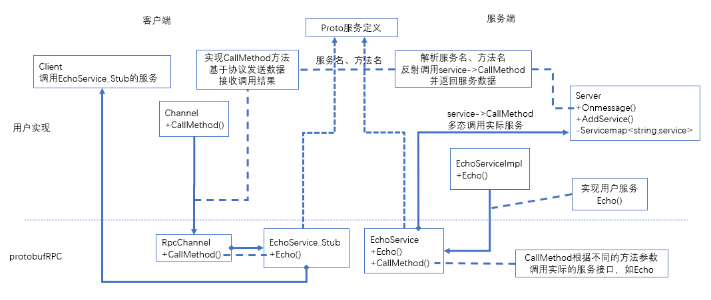

# protobuf的RPC框架  
google protobuf只负责消息的打包和解包，并不包含RPC的实现，但其包含了RPC的定义，本文主要介绍protobuf的RPC实现方法，并简单介绍下brpc的代码实现。  

  
## 目录
* [protobuf的RPC实现](#protobuf的RPC实现)
* [客户端RPC过程](#客户端RPC过程)
* [服务端RPC过程](#服务端RPC过程)
* [整体流程图](#整体流程图)
* [brpc代码解析](#brpc代码解析)
* [brpc服务端启动过程](#brpc服务端启动过程)
* [brpc服务端RPC过程](#brpc服务端RPC过程)

## protobuf的RPC实现  
基于protobuf的RPC实现，首先你需要用proto文件实现相应服务的RPC定义，以echo服务为例。  
```
message EchoRequest {
      string message = 1;
};

message EchoResponse {
      string message = 1;
};

service EchoService {
      rpc Echo(EchoRequest) returns (EchoResponse);
};

//EchoService 	服务名字
//Echo 			EchoService提供的一个服务方法
//EchoRequest	请求参数
//EchoResponse	返回参数
```
定义完上述proto文件后，使用protoc会生成以下两个类。  
```cpp
class EchoService_Stub : public EchoService 
{
  void Echo(::PROTOBUF_NAMESPACE_ID::RpcController* controller,
                       const ::echo::EchoRequest* request,
                       ::echo::EchoResponse* response,
                       ::google::protobuf::Closure* done);
}
//EchoService_Stub是给客户端的接口，其中Echo方法即为提供的服务方法的接口，客户端的RPC接口

class EchoService : public ::PROTOBUF_NAMESPACE_ID::Service 
{
  virtual void Echo(::PROTOBUF_NAMESPACE_ID::RpcController* controller,
                       const ::echo::EchoRequest* request,
                       ::echo::EchoResponse* response,
                       ::google::protobuf::Closure* done);
}
//EchoService是服务端提供服务的具体实现，其中Echo为虚方法，需要服务端具体实现

//可以看到上述两个类的接口一致，这样使得客户端如同调用本地调用一样的效果
```
### 客户端RPC过程  
客户端RPC过程代码主要如下，主要是使用EchoService_Stub调用相应接口。  
```cpp
//EchoService_Stub的构造函数
EchoService_Stub(::PROTOBUF_NAMESPACE_ID::RpcChannel* channel);

//rpc过程如下
{
	echo::EchoRequest req;
	echo::EchoResponse resp;
	Channel channel;
	echo::EchoService_Stub stub(&channel);
	Controller cntl;
	stub.Echo(&cntl, &req, &resp, nullptr);
	//完成RPC，resp处理
}

//RpcController是RPC过程控制类，辅助控制一次RPC
//RpcChannel是通道类，是用户用来实现具体通信的类
```

stub的所有服务，最终都会调用RpcChannel的CallMethod方法  
```cpp
void EchoService_Stub::Echo(::PROTOBUF_NAMESPACE_ID::RpcController* controller,
                              const ::echo::EchoRequest* request,
                              ::echo::EchoResponse* response,
                              ::google::protobuf::Closure* done) {
  channel_->CallMethod(descriptor()->method(0),
                       controller, request, response, done);
}
```
RpcChannel的CallMethod方法是一个虚方法，需要用户自己实现数据传输逻辑，其定义如下    
```cpp
virtual void CallMethod(const MethodDescriptor* method,
                        RpcController* controller, const Message* request,
                        Message* response, Closure* done) = 0;
//MethodDescriptor为方法描述类，可以反射出具体服务名与方法名
```
客户端RPC过程，最终都会调用到RpcChannel的CallMethod方法，用户实现不同的CallMethod，用于实现具体的RPC过程。  
一个简单的echo服务的CallMethod方法定义如下：  
```cpp
void Channel::CallMethod(const ::google::protobuf::MethodDescriptor *method,
		::google::protobuf::RpcController *controller,
		const ::google::protobuf::Message *request,
		::google::protobuf::Message *response,
		::google::protobuf::Closure *done) {
	std::string data_str;
	request->SerializeToString(&data_str);				//序列化请求数据

	srpc::RpcMeta meta;									//传输协议，一般会将调用的服务名、方法名等基本信息传给服务端
	meta.set_service_id(method->service()->name());
	meta.set_method_id(method->name());
	meta.set_data_size(data_str.size());
	std::string meta_str;
	meta.SerializeToString(&meta_str);

	int meta_size = meta_str.size();
	std::string serialized_str;
	serialized_str.insert(0, std::string((const char *)&meta_size, sizeof(int)));
	serialized_str += meta_str;
	serialized_str += data_str;
														//发送数据给服务端，请求RPC
	int nsend = send(fd_, serialized_str.c_str(), serialized_str.size(),MSG_WAITALL);


	int resp_data_len = 0; 
	int nread = recv(fd_, (char *)&resp_data_len, sizeof(int), MSG_WAITALL);	//本例采用同步通信方式
	std::vector<char> resp_buf(resp_data_len, 0);
	recv(fd_, (char *)&resp_buf[0], resp_data_len, MSG_WAITALL);				//接受服务端计算完的数据
	
	
	response->ParseFromString(std::string(&resp_buf[0], resp_buf.size()));		//获取返回数据

	close(fd_);
	return ;
}
```
以上只是一个简单的echo例子，一个具体的RPC实现会考虑：RPC传输协议、RPC传输控制等等各种细节  


### 服务端RPC过程  
服务端接收到客户端的数据后，会执行相应的RPC请求，接下来分析具体服务端响应RPC的过程，以reactor模型为例，RPC的响应函数为OnNewMessage。  
```cpp
void Server::OnNewMessage(const int fd) {
	int rpc_meta_len;
	int num_read = RecvMsg(fd, (char *)&rpc_meta_len, sizeof(int));

	std::vector<char> meta_buf(rpc_meta_len, 0);
	num_read = RecvMsg(fd, (char *)&(meta_buf[0]), rpc_meta_len);

	srpc::RpcMeta rpc_meta;
	
	//接受数据，并解析获得请求数据
	rpc_meta.ParseFromString(std::string(&(meta_buf[0]), meta_buf.size()));

	//根据服务名与方法名反射具体的服务方法描述对象
	google::protobuf::Service* service = services_[rpc_meta.service_id()];
    const google::protobuf::ServiceDescriptor* desc = service->GetDescriptor();
    const google::protobuf::MethodDescriptor* mdescriptor = desc->FindMethodByName(rpc_meta.method_id());
	
	//反射获取请求数据
	auto recv_msg = service->GetRequestPrototype(mdescriptor).New();
	auto resp_msg = service->GetResponsePrototype(mdescriptor).New();

	recv_msg->ParseFromString(std::string(&request_data[0], request_data.size()));
	
	//done为完成对象，CallMethod中最后会调用done->Run()完成数据传输
	auto done = ::google::protobuf::NewCallback(
			&Server::OnCallbackDone, resp_msg, fd);
	Controller cntl;
	
	//反射调用实际服务
	service->CallMethod(mdescriptor, &cntl, recv_msg, resp_msg, done);
	close(fd);
	return;
}

//服务端完成RPC后调用此方法完成数据传输
void Server::OnCallbackDone(::google::protobuf::Message* resp_msg,
		const int fd) {
	int s = resp_msg->ByteSizeLong();
	int nsend = send(fd, (char *)&s, sizeof(int), MSG_WAITALL);
	resp_msg->SerializeToFileDescriptor(fd);
	return ;
}
```

上面service是一个虚基类，实际是EchoService的指针，因此调用的是实际是EchoService::CallMethod，其定义如下  
根据实际服务的描述类调用响应的Echo方法。  
```cpp
void EchoService::CallMethod(const ::PROTOBUF_NAMESPACE_ID::MethodDescriptor* method,
                             ::PROTOBUF_NAMESPACE_ID::RpcController* controller,
                             const ::PROTOBUF_NAMESPACE_ID::Message* request,
                             ::PROTOBUF_NAMESPACE_ID::Message* response,
                             ::google::protobuf::Closure* done) {
  GOOGLE_DCHECK_EQ(method->service(), file_level_service_descriptors_echo_2eproto[0]);
  switch(method->index()) {
    case 0:
      Echo(controller,
             ::PROTOBUF_NAMESPACE_ID::internal::DownCast<const ::echo::EchoRequest*>(
                 request),
             ::PROTOBUF_NAMESPACE_ID::internal::DownCast<::echo::EchoResponse*>(
                 response),
             done);
      break;
    default:
      GOOGLE_LOG(FATAL) << "Bad method index; this should never happen.";
      break;
  }
}
```
用户实现具体的EchoService类以及具体的Echo方法，完成RPC。  
```cpp
class EchoServiceImpl : public ::echo::EchoService {
	public:
		EchoServiceImpl() {
		}

		void Echo(::google::protobuf::RpcController * controller, 
				const ::echo::EchoRequest *request,
				::echo::EchoResponse *response,
				::google::protobuf::Closure *done) {
			
			//直接发送回原来数据，echo服务
			response->set_message(request->message());

			done->Run();
		}
	private:
};
```
总结，服务端调用整体代码如下,主要是创建服务，注册服务，启动服务器  
```cpp
{
	::echo::EchoService *es_ptr = new EchoServiceImpl();
	Server server;
	server.AddService(es_ptr);
	server.Start("127.0.0.1", 8888);
}

//注册服务，创建根据服务名与相应的服务描述类的映射
void RpcServer::registerService(google::protobuf::Service* service)
{
  const google::protobuf::ServiceDescriptor* desc = service->GetDescriptor();
  services_[desc->full_name()] = service;
}
```

### 整体流程图  
整体流程图如下  
  

## brpc代码解析    
brpc是百度开源的一个RPC框架，基于protobuf的RPC实现，整体实现过程与上述过程类似，以下对brpc实现代码做简要分析。  
[brpc源码](https://github.com/apache/incubator-brpc/)

### brpc服务端启动过程  
brpc通过调用Start函数来启动服务器，所有的start方法最终都是调用的StartInternal。  
```
//已经删除了大部分的代码，保留主要要分析的部分
int Server::StartInternal(const butil::ip_t& ip,
                          const PortRange& port_range,
                          const ServerOptions *opt) 
{
	//前期准备工作，看不太懂
	
	//监听
	_listen_addr.ip = ip;
	_listen_addr.port = port;
	butil::fd_guard sockfd(tcp_listen(_listen_addr));

	//创建Acceptor
	_am = BuildAcceptor();
	
	//开始Acceptor
	if (_am->StartAccept(sockfd, _options.idle_timeout_sec,_default_ssl_ctx) != 0)
	
	
}

//StartAccept核心代码如下，给listenfd关联新连接的处理函数OnNewConnections
int Acceptor::StartAccept(int listened_fd, int idle_timeout_sec,
                          const std::shared_ptr<SocketSSLContext>& ssl_ctx) 
{
	//注册新连接处理函数
	SocketOptions options;
    options.fd = listened_fd;
    options.user = this;
    options.on_edge_triggered_events = OnNewConnections;
}

//OnNewConnections会掉用OnNewConnectionsUntilEAGAIN函数，给新连接注册消息回调
void Acceptor::OnNewConnectionsUntilEAGAIN(Socket* acception) 
{
	//accept建立新连接
    butil::fd_guard in_fd(accept(acception->fd(), &in_addr, &in_len));
	
	//注册消息回调
	options.fd = in_fd;
    options.remote_side = butil::EndPoint(*(sockaddr_in*)&in_addr);
    options.user = acception->user();
    options.on_edge_triggered_events = InputMessenger::OnNewMessages;
}

```

实际服务器启动后，处理消息分发的是EventDispatcher，其核心方法Run，主要代码如下  

```
//不断epoll_wait 并调用StartInputEvent或者HandleEpollOut
void EventDispatcher::Run() 
{
	const int n = epoll_wait(_epfd, e, ARRAY_SIZE(e), -1);
	
	for (int i = 0; i < n; ++i) {
            if (e[i].events & (EPOLLIN | EPOLLERR | EPOLLHUP)) 
			 Socket::StartInputEvent(e[i].data.u64, e[i].events,
                                        _consumer_thread_attr);
	for (int i = 0; i < n; ++i) {
            if (e[i].events & (EPOLLOUT | EPOLLERR | EPOLLHUP)) {

                Socket::HandleEpollOut(e[i].data.u64);
            }
	}
}

//StartInputEvent最终调用ProcessEvent
void* Socket::ProcessEvent(void* arg) {
    // the enclosed Socket is valid and free to access inside this function.
    SocketUniquePtr s(static_cast<Socket*>(arg));
    s->_on_edge_triggered_events(s.get());
    return NULL;
}

```
由上可以看出，新消息到来会调用_on_edge_triggered_events，而这正是上面注册的InputMessenger::OnNewMessages  

### brpc服务端RPC过程  
当有RPC到来，服务端会调用InputMessenger::OnNewMessages响应  
```
void InputMessenger::OnNewMessages(Socket* m) {
	//首先读取数据
	while (!read_eof) {
	  const ssize_t nr = m->DoRead(once_read);
	}
	
	//解析生成msg，然后调用QueueMessage，排队处理消息
    DestroyingPtr<InputMessageBase> msg(pr.message());
    QueueMessage(last_msg.release(), &num_bthread_created, m->_keytable_pool);
}

//QueueMessage最终调用msg->_process(msg);
void* ProcessInputMessage(void* void_arg) {
    InputMessageBase* msg = static_cast<InputMessageBase*>(void_arg);
    msg->_process(msg);
    return NULL;
}

//msg->_process是协议注册时注册的协议处理函数，其中最终会调用用户自定义的协议处理函数
```
协议注册过程，所有的协议注册函数最终调用AddServiceInternal，主要完成初始化以及协议注册  
```
int Server::AddServiceInternal(google::protobuf::Service* service,
                               bool is_builtin_service,
                               const ServiceOptions& svc_opt) 
{
	//全局初始化，用于初始化全局协议等
	InitializeOnce();
	
	//使用一个map注册Service
	const google::protobuf::ServiceDescriptor* sd = service->GetDescriptor();
	const ServiceProperty ss = {
    is_builtin_service, svc_opt.ownership, service, NULL };
	_fullname_service_map[sd->full_name()] = ss;
    _service_map[sd->name()] = ss;
}

//InitializeOnce会调用GlobalInitializeOrDie，通过pthread_once保证该函数只执行一次
void GlobalInitializeOrDie() {
    if (pthread_once(&register_extensions_once,
                     GlobalInitializeOrDieImpl) != 0) {
        LOG(FATAL) << "Fail to pthread_once";
        exit(1);
    }
}

//协议初始化函数只执行一次，用来初始化协议原型
//各种协议的具体实现都定义在src/brpc/policy中，用来后续的数据传输
//RegisterProtocol是把当前协议存在一个map中
static void GlobalInitializeOrDieImpl() {
	// Protocols
    Protocol baidu_protocol = { ParseRpcMessage,
                            SerializeRequestDefault, PackRpcRequest,
                            ProcessRpcRequest, ProcessRpcResponse,
                            VerifyRpcRequest, NULL, NULL,
                            CONNECTION_TYPE_ALL, "baidu_std" };
    if (RegisterProtocol(PROTOCOL_BAIDU_STD, baidu_protocol) != 0) {
        exit(1);
    }
	
	Protocol http_protocol = { ParseHttpMessage,
                           SerializeHttpRequest, PackHttpRequest,
                           ProcessHttpRequest, ProcessHttpResponse,
                           VerifyHttpRequest, ParseHttpServerAddress,
                           GetHttpMethodName,
                           CONNECTION_TYPE_POOLED_AND_SHORT,
                           "http" };
    if (RegisterProtocol(PROTOCOL_HTTP, http_protocol) != 0) {
        exit(1);
    }
}

```
接下来以百度标准协议为例，介绍brpc过程，百度标准协议为baidu_std，其具体定义可查看官方文档。  
msg->process在百度标准协议中即为ProcessRpcRequest，其实现如下
```
void ProcessRpcRequest(InputMessageBase* msg_base) {
	
	//获取协议数据
    RpcMeta meta;
    if (!ParsePbFromIOBuf(&meta, msg->meta)) {
	}
	
	//获取service_name
	butil::StringPiece svc_name(request_meta.service_name());
	//根据service_name找到响应服务
    const Server::MethodProperty* mp =
    server_accessor.FindMethodPropertyByFullName(svc_name, request_meta.method_name());
	
	const google::protobuf::MethodDescriptor* method = mp->method;
	google::protobuf::Service* svc = mp->service;
	
	//反射请求数据
	req.reset(svc->GetRequestPrototype(method).New());
	res.reset(svc->GetResponsePrototype(method).New());
	
	//调用服务
	return svc->CallMethod(method, cntl.release(), req.release(), res.release(), done);
	
	//最后调用done->Run(),由RAII机制保证发送
}

//done->Run()实际调用的是endRpcResponse，也是由百度标准协议实现
void SendRpcResponse(int64_t correlation_id,
                     Controller* cntl, 
                     const google::protobuf::Message* req,
                     const google::protobuf::Message* res,
                     const Server* server,
                     MethodStatus* method_status,
                     int64_t received_us)
{
	//序列化数据
	butil::IOBuf res_buf;
    SerializeRpcHeaderAndMeta(&res_buf, meta, res_size + attached_size);
	
	//发送数据
	if (sock->Write(&res_buf, &wopt) != 0) {
	}
}
```

### brpc客户端RPC过程  
stub的所有服务，最终都会调用RpcChannel的CallMethod方法，brpc的Channel的CallMethod定义如下  
```
void Channel::CallMethod(const google::protobuf::MethodDescriptor* method,
                         google::protobuf::RpcController* controller_base,
                         const google::protobuf::Message* request,
                         google::protobuf::Message* response,
                         google::protobuf::Closure* done) 
{
	//首先基于协议对请求数据序列化，_serialize_request实际是SerializeRequestDefault，完成对request的序列化  
	_serialize_request(&cntl->_request_buf, cntl, request);
	
	//最终IssueRPC发起实际的RPC
	cntl->IssueRPC(start_send_real_us);
}

//_serialize_request，在Channel初始化时由InitChannelOptions初始化
//FindProtocol，则是从上述RegisterProtocol的map中获取已经初始化的协议
int Channel::InitChannelOptions(const ChannelOptions* options) {

	const Protocol* protocol = FindProtocol(_options.protocol);
	
    _serialize_request = protocol->serialize_request;
    _pack_request = protocol->pack_request;
    _get_method_name = protocol->get_method_name;
}

void Controller::IssueRPC(int64_t start_realtime_us) {
	//创建一个临时socket，注意此时创建的socekt与event已经关联，事件触发后调用onNewMessage(此处具体是如何关联的有关细节没看太明白)
	SocketUniquePtr tmp_sock;
	const int rc = Socket::Address(_single_server_id, &tmp_sock);
	
	//根据不同协议调用数据打包
    butil::IOBuf packet;
    SocketMessage* user_packet = NULL;
    _pack_request(&packet, &user_packet, cid.value, _method, this, _request_buf, using_auth);
	
	//发送数据
	rc = _current_call.sending_sock->Write(user_packet_guard, &wopt);
}
```

以百度标准协议为例_pack_request实际是
```
void PackRpcRequest(butil::IOBuf* req_buf,
                    SocketMessage**,
                    uint64_t correlation_id,
                    const google::protobuf::MethodDescriptor* method,
                    Controller* cntl,
                    const butil::IOBuf& request_body,
                    const Authenticator* auth) 
{
	RpcMeta meta;
	//设置相关的服务名、方法名
    request_meta->set_service_name(FLAGS_baidu_protocol_use_fullname ?
                                   method->service()->full_name() :
                                   method->service()->name());
    request_meta->set_method_name(method->name());
	
	//序列化数据
	SerializeRpcHeaderAndMeta(req_buf, meta, req_size + attached_size);
}
```
以上完成了客户端RPC数据的发送过程，当服务端完成计算并发送数据，客户端收到数据，则会触发之前设定好的onNewMessage  
onNewMessage具体实现过程与服务端一样，最终调用msg->_process(msg), 根据用户协议的不用实际调用不同的处理函数，以百度标准协议为例，最终实际调用ProcessRpcResponse;
```
void ProcessRpcResponse(InputMessageBase* msg_base) 
{
	//解析数据
	RpcMeta meta;
	ParsePbFromIOBuf(&meta, msg->meta)
	
	//最后通知相关线程，完成RPC(此处有关线程的细节没看太明白)
	accessor.OnResponse(cid, saved_error);
}
```

